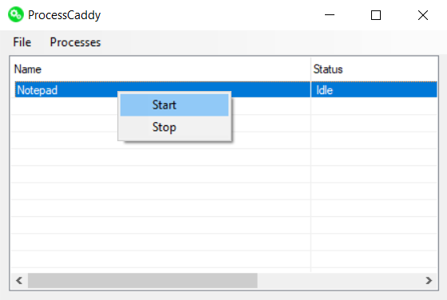

# ProcessCaddy
A simple C# application for starting and monitoring other processes.

### Usage
ProcessCaddy is configured via a single JSON file which lists each application that is to be monitored. Each process can be maintained individually, or all applications can be started/stopped simultaneously using the Process menu Start All and Stop All options. Once an application has been started via the menu options, it will restart automatically if it exits outside of the control of ProcessCaddy.

## Main Window


## Example config.json
```
[
  {
    "name" : "MyApp",
    "exec" : "C:\\MyFolder\\MyApp.exe",
    "args" : "-force_awesome 1"
  }
]
```

The double backslashes are required for the JSON file to be properly parsed.
